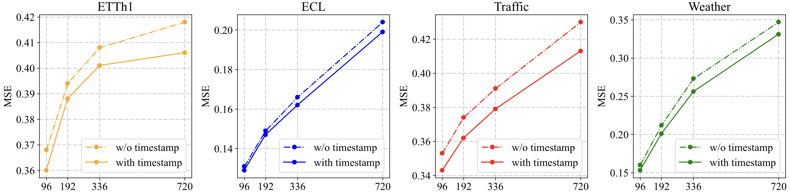
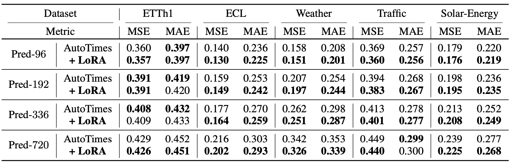
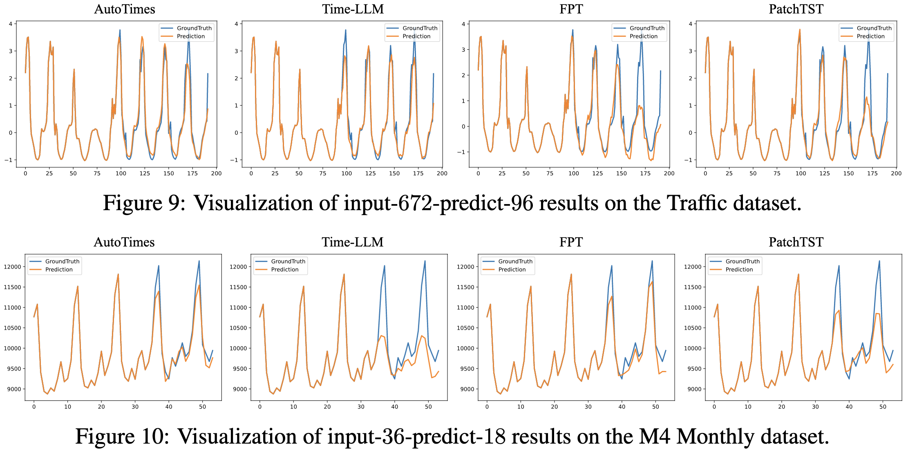

# AutoTimes (Large Language Models for Time Series Forecasting)

<p align="center">

</p>

The repo is the official implementation: [AutoTimes: Autoregressive Time Series Forecasters via Large Language Models](https://arxiv.org/abs/2402.02370).

> **[Time Series Forecasting](./scripts/time_series_forecasting/)**: AutoTimes repurpose LLMs as autoregressive multivariate time series forecasters. Different from previous models, our repurposed forecaster can be applied on various lookback/forecast lengths.

> **[Zero-shot Forecasting](./scripts/zero_shot_forecasting/)**: AutoTimes takes advantage of LLM's general-purposed token transition as the future extrapolation of time series, demonstrating good performance without downstream samples.

> **[In-context Forecasting](./scripts/in_context_forecasting/)**: We propose in-context forecasting for the first time, where time series prompts can further incorporated into the context to enhance forecasting.

> **[Easy-to-use](scripts/method_generality)**: AutoTimes is compatiable with any decoder-only large language models, demonstrating generality and proper scaling behavior.

# Updates

:triangular_flag_on_post: **News** (2024.5) We received lots of valuable suggestions. [A revised version](https://arxiv.org/pdf/2402.02370) (**22 Pages**) is now available, including elaboratedly described methodolgy, training costs, low-rank adaptation of our method.
 
:triangular_flag_on_post: **News** (2024.2) Scripts for the above tasks in our [paper](https://arxiv.org/pdf/2402.02370.pdf) are available in this repo.

## Introduction

🌟 While prevalent LLM4TS methods adapt LLMs as encoder-only and non-autoregressive forecasters, we propose to **keep consistent with the inherent autoregressive property and model architecture**.

<p align="center">

</p>

💪 We aim to **fully revitalize LLMs as foundation models for time series forecasting**, including multi-step forecasting, zero-shot capability, **in-context forecasting**, and multimodal utilization.

🏆 AutoTimes achieves **state-of-the-art performance** with **0.1% trainable parameters and over 5× training/inference speedup** compared to advanced LLM-based forecasters.

## Usage 

1. Install Pytorch and necessary dependencies.

```
pip install -r requirements.txt
```

1. Put the datasets [[Google Drive]](https://drive.google.com/file/d/1t7jOkctNJ0rt3VMwZaqmxSuA75TFEo96/view?usp=sharing)
[[Tsinghua Cloud]](https://cloud.tsinghua.edu.cn/f/849427d3926f4fabbee7/) under the folder ```./dataset/```.

2. Download the large language models from [Hugging Face](https://huggingface.co/). The default LLM is LLaMA-7B, you can change the `llm_ckp_dir` in `run.py` to use other LLMs.
   * [LLaMA-7B](https://huggingface.co/meta-llama/Llama-2-7b)
   * [OPT Family](https://huggingface.co/facebook/opt-125m)
   * [GPT2](https://huggingface.co/openai-community/gpt2)

   For example, if you download LLaMA successfully, the directory structure is as follows:
   - data_provider
   - dataset
   - run.py
   - llama
     - config.json
     - pytorch_model-00001-of-00002.bin
     - pytorch_model-00002-of-00002.bin
     - ...
   - ...


3. [Optional] Generate the position embedding from textual timestamps and add `--mix_embeds` in the corresponding script.
```
# preprocess timestamps to generate text embedding
python ./preprocess.py --gpu 0 --dataset ETTh1
```

4. Train and evaluate the model. We provide all the above tasks under the folder ```./scripts/```.

```
# the default large language model is LLaMA-7B

# long-term forecasting
bash ./scripts/time_series_forecasting/long_term/AutoTimes_ETTh1.sh

# short-term forecasting
bash ./scripts/time_series_forecasting/short_term/AutoTimes_M4.sh

# zero-shot forecasting
# it's worth noting that sM4_tM3 utilizes models trained
# on short-term, you should run AutoTimes_M4 first
bash ./scripts/zero_shot_forecasting/sM4_tM3.sh
bash ./scripts/zero_shot_forecasting/sM3_tM4.sh

# in-context forecasting
bash ./scripts/in_context_forecasting/M3.sh

# try on other large language models
bash ./scripts/method_generality/opt.sh
```

> Due to the simple tokenization and the frozen of LLM blocks, AutoTimes is highly compatiable with LLMs. For example, it requires only **15min** for AutoTime to repurpuse LLaMA-7B on ETTh1 on one single RTX 3090-24G.

### A Simple Example
See ```predict.ipynb``` for a simple training and inference workflow.

## Overall Approach

* Time series and corresponding timestamps are segmented.
* Textual timestamps are converted into the position embedding of segments.
* AutoTimes learns to embed time series segments by next token prediction, where intermediate layers of LLM are frozen.

<p align="center">

</p>

## Capability

<p align="center">

</p>

|            | Non-autoregressive                                           | Autoregressive                                               |
| -------------------- | :----------------------------------------------------------- | :----------------------------------------------------------- |
| Training             | Trained with specific lookback-forecast lengths              | Trained with the context length with **each generated token being supervised** |
| One-step Forecasting | Applicable only on fixed lookback-forecast lengths           | Flexible on scenarios **less than the context length** like large language models |
| Rolling Forecasting  | Has to drop the lookback series because of the fixed input length | **Can prolong the lookback horizon** until the total length exceeds the context length |

## Time Series Forecasting

Towards the vertility of foundation models, we establish a novel **one-for-all** benchmark: a single forecaster is trained on one dataset and subsequently utilized for all prediction lengths, where we achieve SOTA results in **80%** datasets. In the conventional **one-for-one** scenario, AutoTimes still achieved state-of-the-art performance in **70%** of settings.


<p align="center">

</p>

## Zero-shot Forecasting

We evaluate the performance under the transfer learning scenario, where the forecaster is first trained on a source domain and then evaluated on the unseen target domain.

<p align="center">

</p>

## In-context Forecasting

Benefiting from time series prompts from the target domain, LLM-based forecaster can achieves consistent promotions on all M3 subsets and the averaged **13.3%** SMAPE reduction compared with zero-shot forecasting.

<p align="center">

</p>

## Model Generality

We evaluate the generality and efficiency on other LLMs, demonstrating improved performance with the increase of parameters that **validates the scaling law**.

<p align="center">

</p>

## Method Efficiency

Not only does AutoTime achieve more acurate predcitions but its training and reasoning time is also greatly reduced, bringing over 5× speedup on average.

<p align="center">

</p>

## Textual Timestamps as Position Embedding

We conduct ablations our position embedding of textual timestamps. The performance is consistently promoted because of the positional alignment of multivariate time series.

<p align="center">

</p>

## Flexible Input Length

In the conventional paradigm, deep forecasters are trained respectively, limiting their versatility. In contrast, our forecasters handle various input lengths with one model.

<p align="center">

</p>

## Low-rank Adaption

By incorporating [LoRA](https://arxiv.org/abs/2106.09685), the token transition of LLMs can be better aligned to the time series modality with improved performance.

<p align="center">

</p>

## Showcases

<p align="center">

</p>

<p align="center">

</p>

## Citation

If you find this repo helpful, please cite our paper. 

```
@article{liu2024autotimes,
  title={AutoTimes: Autoregressive Time Series Forecasters via Large Language Models},
  author={Liu, Yong and Qin, Guo and Huang, Xiangdong and Wang, Jianmin and Long, Mingsheng},
  journal={arXiv preprint arXiv:2402.02370},
  year={2024}
}
```

## Acknowledgement

We appreciate the following GitHub repos a lot for their valuable code and efforts.
- Time-Series-Library (https://github.com/thuml/Time-Series-Library)
- FPT (https://github.com/DAMO-DI-ML/NeurIPS2023-One-Fits-All)

## Contact

If you have any questions or want to use the code, feel free to contact:
* Yong Liu (liuyong21@mails.tsinghua.edu.cn)
* Guo Qin (qing20@mails.tsinghua.edu.cn)
