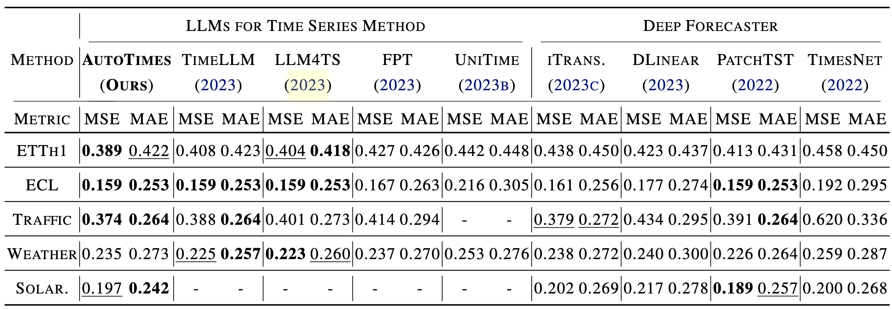
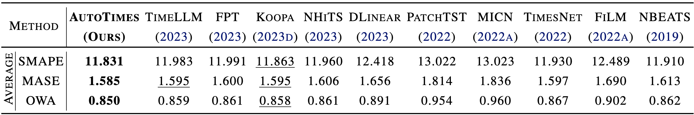
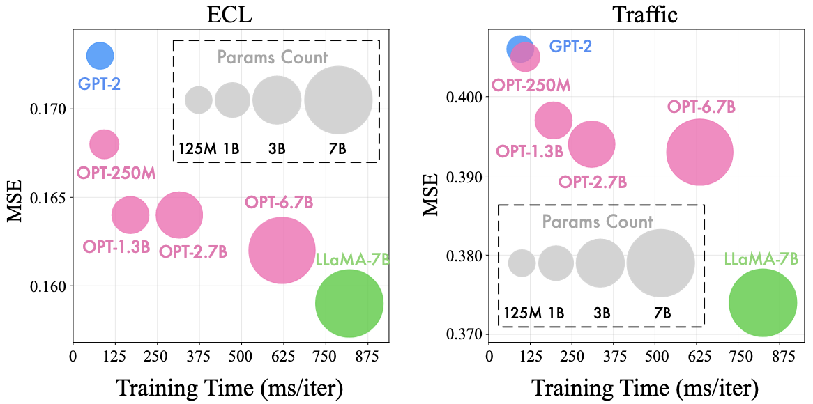

# AutoTimes

The repo is the official implementation for the paper: [AutoTimes: Autoregressive Time Series Forecasters via Large Language Models](https://arxiv.org/abs/2402.02370). It currently includes code implementations for the following tasks:

> **[Time Series Forecasting](./scripts/multivariate_forecasting/)**: We repurpose large language models as out-of-box time series forecasters on benchmarks including long-term and short-term forecasting.

> **[Zero-shot Forecasting](./scripts/zeroshot_forecasting/)**: Large models exhibiting remarkable zero-shot capability are beneficial for data-scarce applications, where AutoTimes takes advantage of this and demonstrates good performance on scenarios without training samples.

> **[In-context Forecasting](./scripts/in-context_forecasting/)**: We propose in-context forecasting in this paper, where instructions in time series itself are available to further enhance forecasting.

> **[Generality on Large Language Models](scripts/llm_generality)**: AutoTimes can be easily applied to various kinds of large language models, demonstrating generality and proper scaling behavior without the burden of heavy fine-tuning.

# Updates

:triangular_flag_on_post: **News** (2024.3) All the scripts for the above tasks in our [paper](https://arxiv.org/pdf/2402.02370.pdf) are available in this repo.


## Introduction

🌟 We propose AutoTimes, a simple but effective way to convert off-the-shelf LLMs as time series forecasters without altering parameters. Token-wise Prompting is proposed to utilize textual information (e.g. timestamps).

<p align="center">

</p>
😊 We ensure the consistency to fully revitalize the capabilities of LLMs as foundation models of time series, including autoregressive token generation, zero-shot capability, in-context learning, and multimodal utilization.

<p align="center">

</p>
🏆 AutoTimes demonstrate competitive results with existing baselines and have shown proficiency in handling variable series lengths: one model for variable forecast lengths and improved performance with prolonged lookback length.

## Overall Architecture

AutoTimes establishes the tokenization of time series and utilizes textual covariates in segments, accomplished by the consistent training task of the next token prediction.

<p align="center">

</p>
We propose to leverage textual covariates, where simple instructions such as timestamps can boost the forecasting performance, aiding the LLM to be aware of the seasonal patterns and align different variates.

## Usage 

1. Install Pytorch and necessary dependencies.

```
pip install -r requirements.txt
```

1. The datasets can be obtained from [Google Drive](#) or [Tsinghua Cloud](#).

2. Download the large language models from [Hugging Face](#).
   1. [GPT2](#)

   2. [OPT Family](#)

   3. [LLaMA-7B](#)

3. Train and evaluate the model. We provide all the above tasks under the folder ./scripts/.

```
# the default large language model is LLaMA-7B

# long-term forecasting
bash ./scripts/time_series_forecasting/long-term_forecasting/AutoTimes_ETTh1.sh

# short-term forecasting
bash ./scripts/time_series_forecasting/short-term_forecasting/AutoTimes_M4.sh

# zero-shot forecasting
bash ./scripts/zeroshot_forecasting/sM4_tM3.sh
bash ./scripts/zeroshot_forecasting/sM3_tM4.sh

# in-context forecasting
bash ./scripts/in-context_forecasting/zeroshot_baseline.sh
bash ./scripts/in-context_forecasting/in-context_forecasting.sh

# other large language models
bash ./scripts/method_generality/opt.sh
```

## Zero-shot Forecasting

we evaluate the performance under the zero-shot scenario, where the forecaster is first trained on a source domain and then directly evaluated on the unseen target domain.

<p align="center">

</p>

## In-context Forecasting

AutoTimes can utilize the instructions or demonstrations of time series. Consequently, we propose in-context forecasting. Based on the zero-shot forecasting scenario, we uniformly select the first time series from the target domain as the demonstration and adopt it as the prompt. The composed “time series sentence” is fed into our forecaster for the prediction of the lookback window.

<p align="center">

</p>
## Time Series Forecasting

AutoTimes demonstrates competitive performance in long-term and short-term scenarios. Notably, AutoTimes adopts only one single model to cope with variable forecast lengths by autoregression, whereas other baselines necessitate training respectively on different lengths.

<p align="center">

</p>
<p align="center">

</p>

## Model Generality

We evaluate the efficiency of each repurposed LLM from three perspectives: forecasting performance, training speed, and parameters, which demonstrates better performance with the increase of parameters validating the scaling law.

<p align="center">

</p>

## Prolonged Lookbacks

As language models can generally give more accurate answers with a longer context, the performance of AutoTimes is generally
improving with the more available lookback observations, which is highly desired in real-world applications.

<p align="center">

</p>
## Prompting Ablation

We conduct the ablation on ou Token-wise Prompting by integrating timestamps. The forecasting performance is
consistently promoted across all datasets and forecasting lengths.

<p align="center">

</p>
## Showcases

<p align="center">

</p>

## Citation

If you find this repo helpful, please cite our paper. 

```
@article{liu2024autotimes,
  title={AutoTimes: Autoregressive Time Series Forecasters via Large Language Models},
  author={Liu, Yong and Qin, Guo and Huang, Xiangdong and Wang, Jianmin and Long, Mingsheng},
  journal={arXiv preprint arXiv:2402.02370},
  year={2024}
}
```

## Acknowledgement

We appreciate the following GitHub repos a lot for their valuable code and efforts.
- Time-Series-Library (https://github.com/thuml/Time-Series-Library)
- FPT (https://github.com/DAMO-DI-ML/NeurIPS2023-One-Fits-All)

## Contact

If you have any questions or want to use the code, feel free to contact:
* Yong Liu (liuyong21@mails.tsinghua.edu.cn)
* Guo Qin (qing20@mails.tsinghua.edu.cn)
