# AutoTimes (Large Language Models for Time Series Forecasting)

Official implementation: [AutoTimes: Autoregressive Time Series Forecasters via Large Language Models](https://arxiv.org/abs/2402.02370). [[Slides]](https://cloud.tsinghua.edu.cn/f/7689d30f92594ded84f0/), [[Poster]](https://cloud.tsinghua.edu.cn/f/f2c18ae34fef4e74ad46/)

<p align="center">

</p>

> **[Time Series Forecasting](./scripts/time_series_forecasting/)**: AutoTimes convert LLMs to autoregressive time series forecasters. Unlike previous methods, the forecaster can accommodate arbitrary-length lookback and predictions.

> **[Zero-Shot Forecasting](./scripts/zero_shot_forecasting/)**: AutoTimes takes advantage of LLM's general-purposed token transition as the future extrapolation of time series, demonstrating good performance without downstream samples.

> **[In-Context Forecasting](./scripts/in_context_forecasting/)**: We propose in-context forecasting [for the first time](https://arxiv.org/abs/2402.02370v1), where time series prompts can be incorporated into the input context to enhance forecasting.

> **[Easy-to-Use](scripts/method_generality)**: AutoTimes is compatiable with any decoder-only large language models, demonstrating generality and proper scaling behavior.

## Updates

:triangular_flag_on_post:  News  (2024.10): An introduction of our works in available [[Slides]](https://cloud.tsinghua.edu.cn/f/7689d30f92594ded84f0/). See you at **NeurIPS 2024**!

:triangular_flag_on_post:  News  (2024.10): AutoTimes has been accepted by **NeurIPS 2024**. [A revised version](https://arxiv.org/pdf/2402.02370) (**25 Pages**) is now available, including prompt engineering of in-context forecasting, adaptation cost evaluations, textual embeddings of metadata, and low-rank adaptation techique.

:triangular_flag_on_post:  News  (2024.08): [Recent work](https://arxiv.org/abs/2406.16964) [(code)](https://github.com/bennytmt/ts_models) has also raised questions about previous non-autoregressive LLM4TS methods. We conduct ablations [here](./figures/ablation_llm.png), highlighting AutoTimes can truly utilize LLMs. Instead of adopting LLMs in a BERT-style, **the general-purpose token transition is transferable among time series and natural language**.

<p align="center">
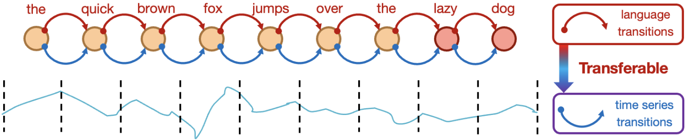
</p>
 
:triangular_flag_on_post: **News** (2024.2) Scripts for the above tasks in our [paper](https://arxiv.org/pdf/2402.02370.pdf) are all available.

## Introduction

🌟 While prevalent LLM4TS methods adapt LLMs as encoder-only and non-autoregressive forecasters, we propose to **keep consistent with the inherent autoregressive property and model architecture**.

<p align="center">
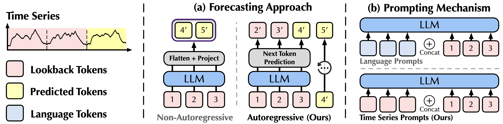
</p>

💪 We aim to **fully revitalize LLMs as foundation models for time series forecasting**, including multi-step forecasting, zero-shot capability, **in-context forecasting**, and multimodal utilization.

🏆 AutoTimes achieves **state-of-the-art performance** with **0.1% trainable parameters and over 5× training/inference speedup** compared to advanced LLM-based forecasters.

## Usage 

1. Install Pytorch and necessary dependencies.

```
pip install -r requirements.txt
```

1. Put the datasets [[Google Drive]](https://drive.google.com/file/d/1t7jOkctNJ0rt3VMwZaqmxSuA75TFEo96/view?usp=sharing)
[[Tsinghua Cloud]](https://cloud.tsinghua.edu.cn/f/0a758154e0d44de890e3/) under the folder ```./dataset/```.

2. Download the large language models from [Hugging Face](https://huggingface.co/). The default LLM is LLaMA-7B, you can change the `llm_ckp_dir` in `run.py` to use other LLMs.
   * [LLaMA-7B](https://huggingface.co/meta-llama/Llama-2-7b)
   * [OPT Family](https://huggingface.co/facebook/opt-125m)
   * [GPT2](https://huggingface.co/openai-community/gpt2)

   For example, if you download and put the LLaMA directory successfully, the directory structure is as follows:
   - data_provider
   - dataset
   - llama
     - config.json
     - pytorch_model-00001-of-00002.bin
     - pytorch_model-00002-of-00002.bin
     - ...
   - ...
   - run.py

3. Using the position embedding from textual timestamps. Note that we have provided the embeddings of the given datasets in the download links, which are generated by LLaMA, suffixed by `{dataset_name}.pt`. If you want to generate the embeddings from your customized datasets, please refer to the following codes:
```
# preprocess timestamps to generate text embedding
python ./preprocess.py --gpu 0 --dataset ETTh1
```

4. Train and evaluate the model. We provide all the above tasks under the folder ```./scripts/```.

```
# the default large language model is LLaMA-7B

# long-term forecasting
bash ./scripts/time_series_forecasting/long_term/AutoTimes_ETTh1.sh

# short-term forecasting
bash ./scripts/time_series_forecasting/short_term/AutoTimes_M4.sh

# zero-shot forecasting
# it's worth noting that sM4_tM3 utilizes models trained
# on short-term, you should run AutoTimes_M4 first
bash ./scripts/zero_shot_forecasting/sM4_tM3.sh
bash ./scripts/zero_shot_forecasting/sM3_tM4.sh

# in-context forecasting
bash ./scripts/in_context_forecasting/M3.sh

# try on other large language models
bash ./scripts/method_generality/opt.sh
```

> Due to the simple tokenization and the frozen of LLM blocks, AutoTimes is highly compatiable with LLMs. For example, it requires only **15min** for AutoTime to repurpuse LLaMA-7B on ETTh1 on one single RTX 3090-24G.

### A Usage Example
See ```predict.ipynb``` for a simple training and inference workflow.

## Overall Approach

* Time series and corresponding timestamps are segmented.
* Textual timestamps are converted into the position embedding of segments.
* AutoTimes learns to embed time series segments by next token prediction, where intermediate layers of LLM are frozen.

<p align="center">
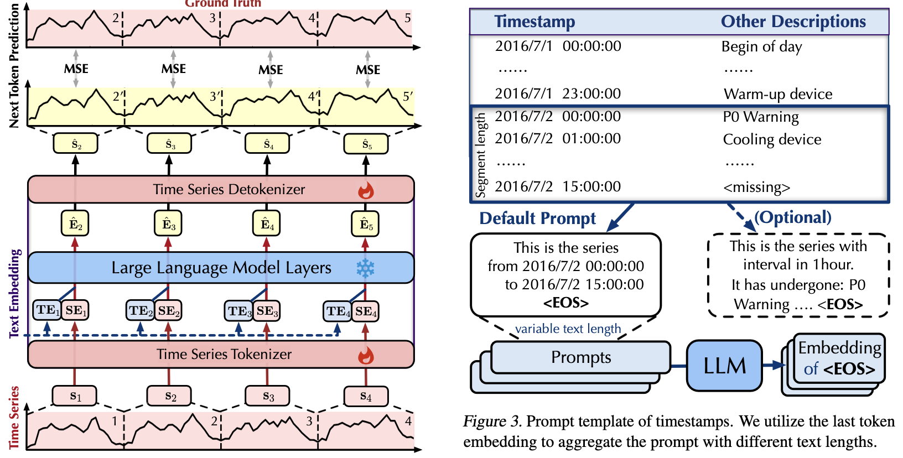
</p>

## Capability

<p align="center">
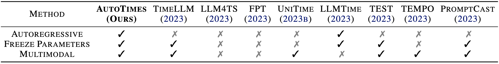
</p>

|            | Non-Autoregressive                                           | Autoregressive                                               |
| -------------------- | :----------------------------------------------------------- | :----------------------------------------------------------- |
| Training             | Trained with specific lookback-forecast lengths              | Trained with the context length with **each generated token being supervised** |
| One-step Forecasting | Applicable only on fixed lookback-forecast lengths           | Flexible on scenarios **less than the context length** like large language models |
| Rolling Forecasting  | Has to drop the lookback series because of the fixed input length | **Can prolong the lookback horizon** until the total length exceeds the context length |

## Time Series Forecasting

Towards the versatility of foundation models, we establish a novel **one-for-all** benchmark: a single forecaster is trained on one dataset and subsequently utilized for all prediction lengths.


<p align="center">
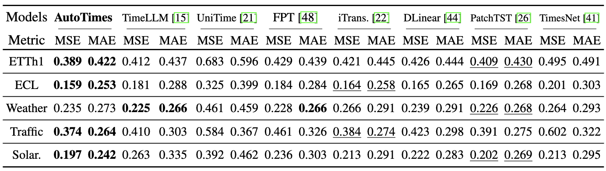
</p>

## Zero-Shot Forecasting

We evaluate the performance under the transfer learning scenario, where the forecaster is first trained on a source domain and then evaluated on the unseen target domain.

<p align="center">
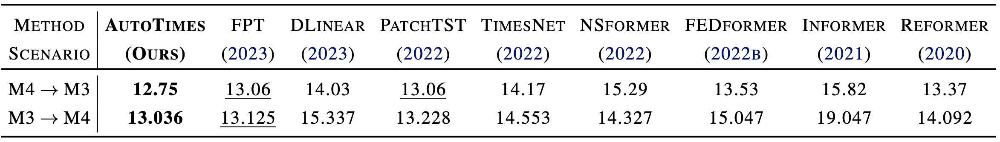
</p>

## In-Context Forecasting

We concatenate time series prompts with lookback series and feed them as the context of the forecaster, termed **in-context forecasting**.

<p align="center">
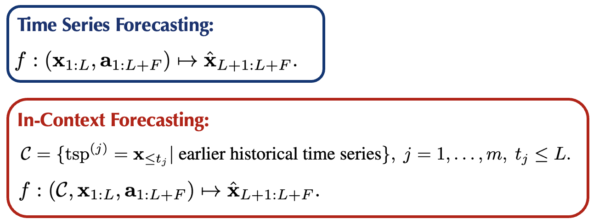
</p>

Benefiting from time series prompts from the target domain, AUTOTIMES achieves consistent promotions (averaged **13.3%** SMAPE reduction) compared with zero-shot forecasting.

<p align="center">
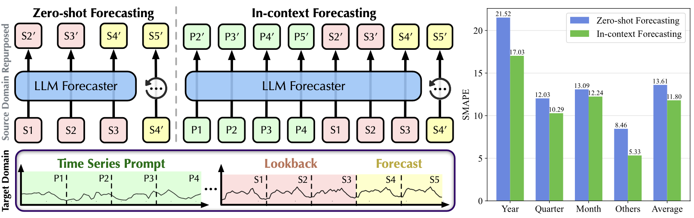
</p>

## Model Generality

We evaluate the generality and efficiency on other LLMs, demonstrating improved performance with the increase of parameters that **validates the scaling law**.

<p align="center">
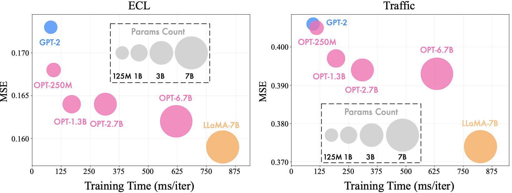
</p>

## Method Efficiency

Not only does AutoTime achieve more acurate predcitions but its training and reasoning time is also greatly reduced, bringing over **5× speedup** on average.

<p align="center">

</p>

## Showcases
We investigate different prompt retrieval strategies. Insightful results are provided to reveal the influence of using time series prompts for interactive prediction.

<p align="center">
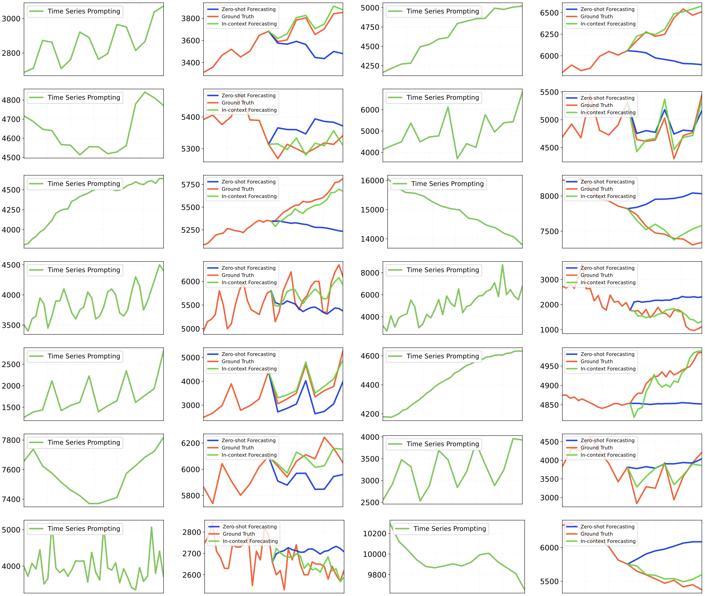
</p>

<p align="center">
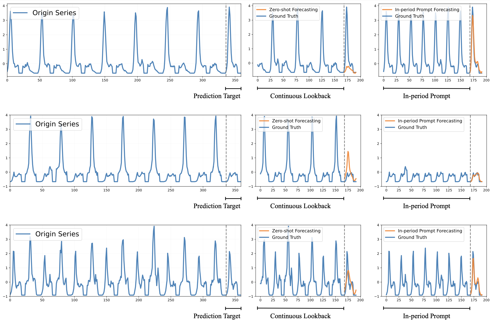
</p>

## Citation

If you find this repo helpful, please cite our paper. 

```
@article{liu2024autotimes,
  title={AutoTimes: Autoregressive Time Series Forecasters via Large Language Models},
  author={Liu, Yong and Qin, Guo and Huang, Xiangdong and Wang, Jianmin and Long, Mingsheng},
  journal={arXiv preprint arXiv:2402.02370},
  year={2024}
}
```

## Acknowledgement

We appreciate the following GitHub repos a lot for their valuable code and efforts.
- Time-Series-Library (https://github.com/thuml/Time-Series-Library)
- FPT (https://github.com/DAMO-DI-ML/NeurIPS2023-One-Fits-All)

## Contact

If you have any questions or want to use the code, feel free to contact:
* Yong Liu (liuyong21@mails.tsinghua.edu.cn)
* Guo Qin (qinguo24@mails.tsinghua.edu.cn)
